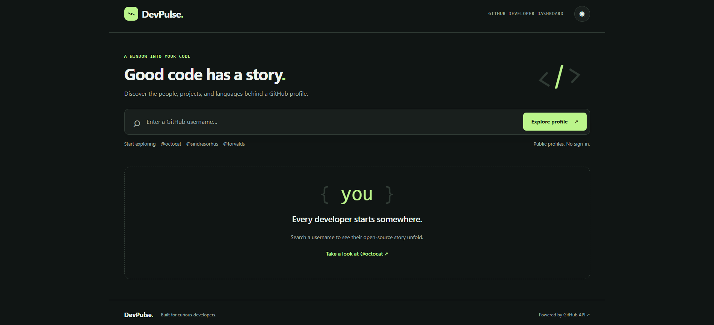
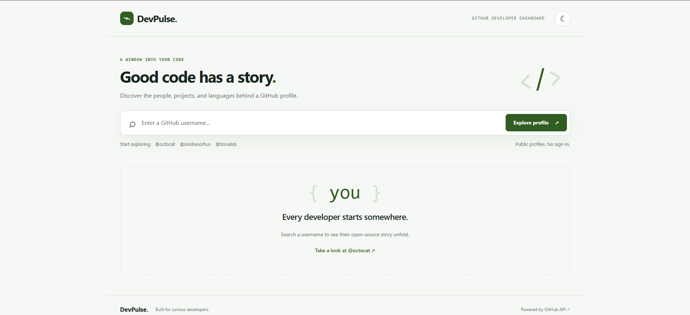
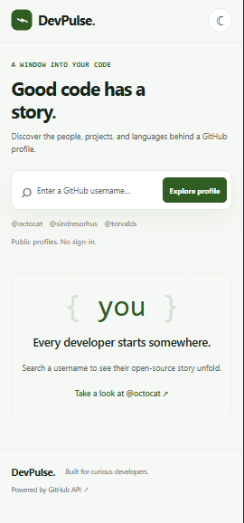

# DevPulse — GitHub Developer Dashboard

A responsive dashboard that turns public GitHub profiles into a clear picture of a developer's repositories, community reach, and programming languages. Built from scratch with HTML, CSS, and vanilla JavaScript.

## Features

- Search any public GitHub username, with optional `@` prefix and example profiles.
- Profile avatar, name, bio, location, join date, followers, following, and public repository count.
- Six top repositories ranked by stars, with forks as a tie-breaker, then repository name.
- Repository descriptions, language labels, stars, forks, and archived/fork badges.
- Total stars and forks across the loaded repositories.
- Proportional language bar and percentages based on each repository's primary language.
- Dark and light themes, initially matching the device and remembering your choice when storage is available.
- Responsive desktop and mobile layouts, keyboard controls, visible focus, skip link, live announcements, and reduced-motion support.
- Loading skeletons, empty states, input validation, missing-user errors, timeout/network handling, rate-limit messages, and retry.
- Abort superseded searches and reuse recent results for five minutes in memory.

## Tech stack

| Layer | Technology |
| --- | --- |
| Structure | Semantic HTML5 |
| Styling | CSS custom properties, Grid, Flexbox, media queries |
| Interaction | Vanilla JavaScript, Fetch API, AbortController, DOM API |
| Data | Public GitHub REST API |
| Preferences | Optional localStorage for the theme only |
| Hosting | Any static server or GitHub Pages |

No React, Node.js, database, package installation, API key, build process, or external UI library is required. Fonts use the operating system's installed fonts.

## Project structure

```text
devpulse/
├── index.html
├── css/
│   └── style.css
├── js/
│   └── app.js
├── assets/
│   ├── favicon.svg
│   └── screenshots/
│       └── README.md
├── .gitignore
├── .nojekyll
├── README.md
└── LICENSE
```

## Local setup

1. Download/extract this project, or clone your own copy of the repository.
2. Open a terminal in the `devpulse` directory containing `index.html`.
3. Start a static server with Python 3:

   ```sh
   python -m http.server 8000 --bind 127.0.0.1
   ```

   On Windows, `py -m http.server 8000 --bind 127.0.0.1` also works when the Python launcher is installed. On macOS/Linux, your command may be `python3`.

4. Open [http://localhost:8000](http://localhost:8000).
5. Stop the server with `Ctrl+C` when finished.

Alternatively, open the folder in VS Code and use its Live Server extension. Python only serves files during development; the website itself runs entirely in the browser. An internet connection is needed for GitHub data and avatars.

## Usage

Enter a username, such as `octocat`, and select **Explore profile** or press Enter. You can also choose an example below the search box. View the overview, language mix, and top six repositories, then follow repository links to GitHub. Use the sun/moon button in the header to switch themes.

For failed requests, read the error message and select **Try again**, or search another username. Searching again can replace an in-progress search without waiting for it to finish.

## Data definitions and limitations

- Profiles come from `GET /users/{username}`; repositories come from `GET /users/{username}/repos?type=owner&sort=updated&per_page=100&page={page}`.
- Repository pages are fetched sequentially using GitHub's `Link` pagination metadata, up to 10 pages (1,000 repositories). Large profiles display a partial-coverage notice. Their stars, forks, language mix, and rankings cover only the loaded subset. The profile's public-repository count remains GitHub's reported count.
- Totals include owned public repositories, including forks and archived repositories. They exclude private repositories and contributions to repositories owned by other accounts. Stars means stars **received**, not repositories the person has starred.
- Overview totals of 10,000 or more use compact notation for readability. Hover over a total for the exact value; assistive technology also receives the exact value.
- Language percentages count repositories with a non-null primary language. Each contributes once; this is not a code-volume measurement. Percentages are rounded independently and may not add to exactly 100%.
- The API is unauthenticated. GitHub normally allows 60 requests per hour per originating IP, which may be shared by other users. A successful uncached search uses one profile request plus one request per repository page. Error messages honor the reset time when GitHub supplies it. See [GitHub rate limits](https://docs.github.com/en/rest/using-the-rest-api/rate-limits-for-the-rest-api).
- Results are cached in the current tab for five minutes, up to 15 profiles. Reloading clears the cache; Retry bypasses it. GitHub data can change while pagination is in progress.
- Each request times out after 15 seconds. If a page fails, the dashboard shows an error rather than reporting incomplete totals as complete.
- All profile and repository text is inserted as text, not interpreted HTML. No credentials are collected. Requests go directly from your browser to GitHub; avatars load from GitHub's image service.
- DevPulse is an independent project and is not affiliated with GitHub. Profile popularity metrics are not measures of developer ability.

API reference: [GitHub repository endpoints](https://docs.github.com/en/rest/repos/repos#list-repositories-for-a-user).

## Screenshots

### Desktop — Dark Mode



### Desktop — Light Mode



### Mobile View



## Deploy to GitHub Pages

1. Create a public GitHub repository named `devpulse`.
2. Upload the **contents** of this project's `devpulse` folder to the repository root. `index.html` must be at the root, not inside another `devpulse` directory. Include `.nojekyll`.
3. Commit the files to `main`.
4. Open the repository's **Settings → Pages**.
5. Under **Build and deployment**, choose **Deploy from a branch**.
6. Select **main**, choose **/(root)**, and click **Save**.
7. Wait for the Pages deployment to finish, then open the URL shown in Settings. It normally looks like `https://YOUR-USERNAME.github.io/devpulse/`.

The relative CSS, JavaScript, and asset paths work under a GitHub Pages repository subpath. No environment variables or build command are needed. Subsequent pushes to `main` update the website.

See [GitHub's publishing-source instructions](https://docs.github.com/en/pages/getting-started-with-github-pages/configuring-a-publishing-source-for-your-github-pages-site). If you see a 404, check that Pages finished deploying and `index.html` is in the selected publishing folder.

## Verification checklist

The delivered version passed 25 browser checks with controlled API responses, plus a successful live `octocat` search and desktop/mobile visual review. See [VERIFICATION.md](VERIFICATION.md) for coverage and limits. Use the following checklist when making changes:

- Search `octocat`; compare profile values and repository links with GitHub.
- Check that stars and forks totals cover all loaded pages and that top repositories are sorted correctly.
- Search a missing username; verify a clear message and a working retry.
- Submit blank input or a profile URL; verify validation.
- Use an account with no repositories; verify zero totals and empty language/repository states.
- Test a failed network request, API rate limit, and search replacement during loading.
- Toggle the theme and reload; verify persistence.
- Inspect at 390 px and desktop widths; use the keyboard and zoom the page to 200%.

## Customize

Edit the theme variables at the start of `css/style.css`, the text in `index.html`, and the example usernames in the `data-user` buttons. API behavior and the language palette live in `js/app.js`. Keep the repository-coverage notice if you change the pagination cap.

## Author

**Muhammad Talha Khan**

Computer Science student and developer.

- GitHub: [Your GitHub Profile](https://github.com/TalhaBytes)

## License

Released under the [MIT License](LICENSE).
